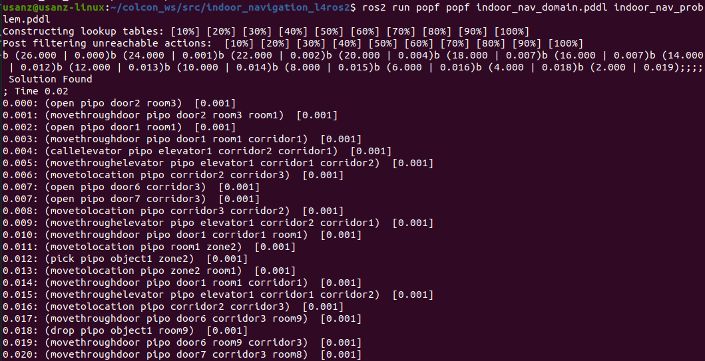
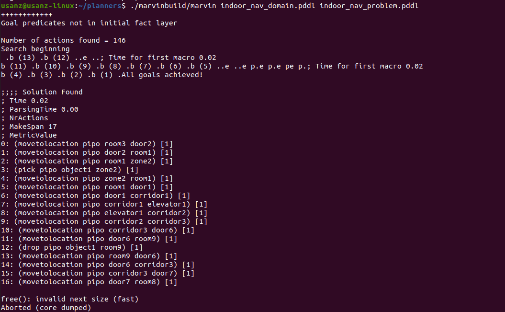

# indoor_navigation_l4ros2
Repo for uploading and document the indoor navigation project in PDDL

## Enunciado del problema:
• Diseña un modelo y 3 problemas de prueba para que
un robot se mueva y transporte objetos entre zonas y
habitaciones de un hospital.

• Una habitación puede tener más de una zona.

• Las habitaciones pueden estar conectadas por
pasillos o puertas.

• Los pasillos se pueden conectar con otros pasillos por
medio de puertas o ascensores

• Una puerta puede estar abierta o cerrada. Si está
cerrada, es necesario abrirla para atravesarla

• Las acciones de tomar un ascensor, cruzar una puerta,
abrir/cerrar una puerta, o distintos tipos de
movimiento del robot son diferentes

• Un objeto puede estar en una habitación o en una
zona concreta

## Imagen de ejemplo:

# Different planners solutions

## Popf solution:

## Marvin2 solution:

